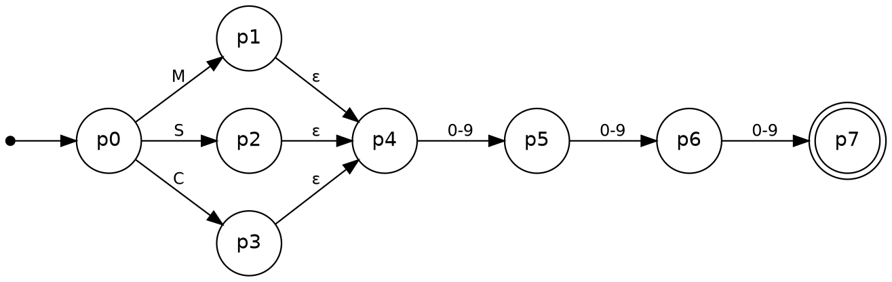
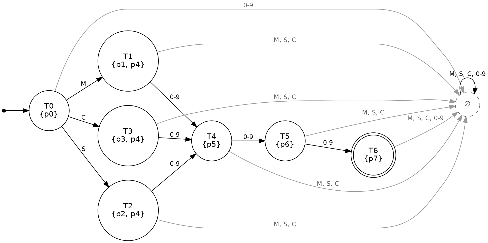
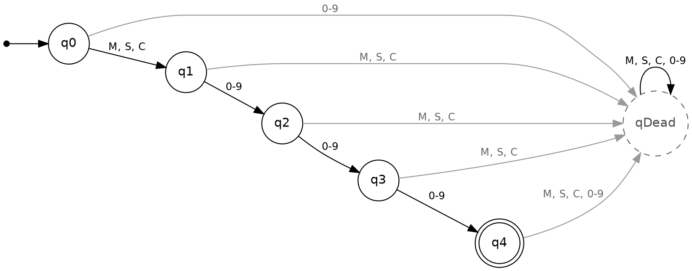

# PharmaHub Product-Code Recognizer: Automata Design

This document covers the theory half of the project: the problem, the formal language, the regular expression, the NFA, the NFA-to-DFA conversion, and the DFA minimization. Every table below can be reproduced by running:

```
python cli/simulator.py --theory
```

That command builds the NFA, runs subset construction and minimization in code, and confirms the result is the same DFA the simulator uses (`backend/app/automata/construction.py`).

---

## 1. Problem definition

**What problem does the system solve?** A pharmacy inventory needs every product to have a well-formed product code. Mistyped codes (`M01`, `MM123`, `m123`, `M 123`) create duplicate or unfindable records. PharmaHub checks every code with a finite automaton before a medicine can be saved, and the recognizer screen lets a user test any code and watch the automaton process it.

**Who might use it?** Pharmacy inventory managers and pharmacists adding or editing medicines, system administrators setting code rules, and developers who need a reliable validation step before data enters the database.

**What input does it receive?** A string of characters typed by the user, for example `M001`.

**What is a valid input?** Exactly four symbols: one category letter followed by three digits.

| Letter | Category |
|---|---|
| `M` | Medicine |
| `S` | Supplement |
| `C` | Consumable |

**What is an invalid input?** Anything else: a wrong or missing letter, too few or too many digits, letters and digits in the wrong order, lowercase letters, spaces, or any symbol outside the alphabet.

**Why can finite automata represent it?** Checking a code only requires remembering how far along the pattern we are (no letter yet, letter read, 1, 2 or 3 digits read, or already failed). That is a fixed, finite amount of memory, so a DFA with a handful of states is enough. No counting beyond 3 and no matching of nested structures is needed. The language is also finite (3,000 strings), and every finite language is regular.

---

## 2. Formal language specification

### 2.1 Alphabet

Σ = { M, S, C, 0, 1, 2, 3, 4, 5, 6, 7, 8, 9 }  (13 symbols)

For readability we write **L₁ = {M, S, C}** (category letters) and **D = {0, 1, …, 9}** (digits). The ten digits always behave the same way, so tables group them into one column labelled `D` or `0-9`. In the machine itself each digit is still its own symbol.

### 2.2 Strings

A string is any finite sequence of symbols from Σ, including the empty string ε. Σ* is the set of all such strings. Examples: `M001`, `S`, `123`, `MM`, `C0012`, ε.

### 2.3 Language

L = { x d₁ d₂ d₃ | x ∈ {M, S, C} and d₁, d₂, d₃ ∈ D }

Every string in L has length exactly 4. |L| = 3 × 10 × 10 × 10 = **3,000** valid codes.

### 2.4 Accepted strings (10)

| # | String | Why it is in L |
|---|---|---|
| 1 | `M001` | M + three digits |
| 2 | `M123` | M + three digits |
| 3 | `S001` | S + three digits |
| 4 | `S002` | S + three digits |
| 5 | `C001` | C + three digits |
| 6 | `C002` | C + three digits |
| 7 | `M999` | largest Medicine code |
| 8 | `S250` | S + three digits |
| 9 | `C500` | C + three digits |
| 10 | `M042` | leading zero is still a digit |

### 2.5 Rejected strings (10)

| # | String | Why it is not in L |
|---|---|---|
| 1 | `M01` | only 2 digits (too short) |
| 2 | `C0012` | 4 digits (too long) |
| 3 | `A123` | `A` is not in Σ |
| 4 | `123` | no category letter |
| 5 | `MM123` | two letters |
| 6 | `C12A` | `A` is not in Σ, and a letter appears where a digit is required |
| 7 | ε (empty) | length 0 |
| 8 | `m123` | lowercase `m` is not in Σ |
| 9 | `S12` | only 2 digits |
| 10 | `S1234` | 4 digits (too long) |

---

## 3. Regular expression

### 3.1 The expression

**R = (M | S | C) D D D**, where **D = (0 | 1 | 2 | 3 | 4 | 5 | 6 | 7 | 8 | 9)**

Written out in full: (M|S|C)(0|1|…|9)(0|1|…|9)(0|1|…|9). In practical regex syntax (used by the Python test suite) this is `^(M|S|C)[0-9][0-9][0-9]$`.

### 3.2 Components and meaning

| Component | Operator | Meaning |
|---|---|---|
| `(M | S | C)` | union | exactly one category letter: Medicine, Supplement or Consumable |
| `D = (0 | 1 | … | 9)` | union | exactly one digit |
| `D D D` | concatenation | three digits in a row, forming the item number 000–999 |
| `(M|S|C)` followed by `DDD` | concatenation | the letter must come first, then the digits |

There is no Kleene star, so the expression cannot produce strings longer than 4 symbols. That is why codes like `S1234` are rejected.

### 3.3 How valid strings match

`M042`: `M` matches `(M|S|C)` by choosing the first alternative. `0`, `4` and `2` each match one `D`. All four symbols are used with nothing left over, so it **matches**.

`C500`: `C` matches the third alternative of `(M|S|C)`, and `5`, `0`, `0` match `D D D`. **Matches**.

### 3.4 Why invalid strings are rejected

| String | Where matching fails |
|---|---|
| `123` | `1` cannot match `(M|S|C)` |
| `MM123` | second `M` cannot match the first `D` |
| `M01` | runs out of input before the third `D` |
| `S1234` | after `DDD` the expression is finished but `4` is left over |
| `m123` | `m` is not in Σ, so no part of R can match it |
| ε | `(M|S|C)` needs one symbol and there is none |

---

## 4. NFA construction

The ε-NFA is built directly from R. The union `(M|S|C)` becomes three branches (one per category), ε-transitions join the branches, and the concatenation `DDD` becomes a chain of three digit transitions.



### 4.1 Formal definition

M_N = (Q, Σ, δ, q₀, F)

- Q = { p0, p1, p2, p3, p4, p5, p6, p7 }
- Σ = { M, S, C, 0, 1, …, 9 }
- q₀ = p0
- F = { p7 }
- δ : Q × (Σ ∪ {ε}) → P(Q), given in the table below

| State | Meaning |
|---|---|
| p0 | start |
| p1 | read M (Medicine branch) |
| p2 | read S (Supplement branch) |
| p3 | read C (Consumable branch) |
| p4 | category done, expecting digit 1 |
| p5 | 1 digit read |
| p6 | 2 digits read |
| p7 | 3 digits read (accepting) |

### 4.2 Transition table

| δ | M | S | C | D (0–9) | ε |
|---|---|---|---|---|---|
| → p0 | {p1} | {p2} | {p3} | ∅ | ∅ |
| p1 | ∅ | ∅ | ∅ | ∅ | {p4} |
| p2 | ∅ | ∅ | ∅ | ∅ | {p4} |
| p3 | ∅ | ∅ | ∅ | ∅ | {p4} |
| p4 | ∅ | ∅ | ∅ | {p5} | ∅ |
| p5 | ∅ | ∅ | ∅ | {p6} | ∅ |
| p6 | ∅ | ∅ | ∅ | {p7} | ∅ |
| \* p7 | ∅ | ∅ | ∅ | ∅ | ∅ |

(→ marks the start state, \* marks the accepting state.)

**Why this is an NFA and not a DFA:** it has ε-transitions (p1, p2, p3 → p4 without reading input), and many transitions go to ∅ (no move), which a DFA does not allow.

---

## 5. NFA-to-DFA conversion (subset construction)

Each DFA state is a **set of NFA states**. For a DFA state T and symbol a:

δ′(T, a) = ε-closure( move(T, a) )

where move(T, a) is every NFA state reachable from T on `a`, and ε-closure adds every state reachable by ε-moves. DFA states are named T0, T1, … (not A, B, C, D, because C and D are already symbols in this project).

### 5.1 Initial subset

ε-closure({p0}) = {p0}, since p0 has no ε-moves. This is **T0**, the DFA start state.

### 5.2 Step-by-step construction

| Step | DFA state | Symbol | move | ε-closure | Result |
|---|---|---|---|---|---|
| 1 | T0 = {p0} | M | {p1} | {p1, p4} | **T1** (new) |
| 2 | T0 | S | {p2} | {p2, p4} | **T2** (new) |
| 3 | T0 | C | {p3} | {p3, p4} | **T3** (new) |
| 4 | T0 | D | ∅ | ∅ | **∅** (new, dead state) |
| 5 | T1 = {p1, p4} | M, S, C | ∅ | ∅ | ∅ |
| 6 | T1 | D | {p5} | {p5} | **T4** (new) |
| 7 | T2 = {p2, p4} | M, S, C | ∅ | ∅ | ∅ |
| 8 | T2 | D | {p5} | {p5} | T4 |
| 9 | T3 = {p3, p4} | M, S, C | ∅ | ∅ | ∅ |
| 10 | T3 | D | {p5} | {p5} | T4 |
| 11 | ∅ | any | ∅ | ∅ | ∅ |
| 12 | T4 = {p5} | M, S, C | ∅ | ∅ | ∅ |
| 13 | T4 | D | {p6} | {p6} | **T5** (new) |
| 14 | T5 = {p6} | M, S, C | ∅ | ∅ | ∅ |
| 15 | T5 | D | {p7} | {p7} | **T6** (new) |
| 16 | T6 = {p7} | any | ∅ | ∅ | ∅ |

No new subsets appear after step 16, so the construction stops.

### 5.3 Reachable subsets

T0 = {p0}, T1 = {p1, p4}, T2 = {p2, p4}, T3 = {p3, p4}, T4 = {p5}, T5 = {p6}, T6 = {p7}, and ∅.

Only **8 of the 2⁸ = 256** possible subsets of Q are reachable. The other 248 are never generated.

### 5.4 Accepting states

A DFA state is accepting if its subset contains the NFA accepting state p7. Only **T6 = {p7}** qualifies.

### 5.5 DFA transition table

| DFA state | NFA subset | M | S | C | D (0–9) |
|---|---|---|---|---|---|
| → T0 | {p0} | T1 | T2 | T3 | ∅ |
| T1 | {p1, p4} | ∅ | ∅ | ∅ | T4 |
| T2 | {p2, p4} | ∅ | ∅ | ∅ | T4 |
| T3 | {p3, p4} | ∅ | ∅ | ∅ | T4 |
| T4 | {p5} | ∅ | ∅ | ∅ | T5 |
| T5 | {p6} | ∅ | ∅ | ∅ | T6 |
| \* T6 | {p7} | ∅ | ∅ | ∅ | ∅ |
| ∅ (dead) | ∅ | ∅ | ∅ | ∅ | ∅ |

### 5.6 DFA state diagram



---

## 6. DFA minimization

### 6.1 Unreachable states

Starting from T0 and following every transition reaches T1, T2, T3, T4, T5, T6 and ∅. **No unreachable states.**

### 6.2 Final and non-final partition

P0: { T0, T1, T2, T3, T4, T5, ∅ } (non-final) and { T6 } (final)

### 6.3 Equivalent-state analysis (partition refinement)

In each round, states in the same block stay together only if, for every symbol, they move into the same block.

**Round 1.** On a digit, T5 moves into the final block {T6}, while every other non-final state moves into a non-final block. T5 is split off.
P1: {T0, T1, T2, T3, T4, ∅}, {T5}, {T6}

**Round 2.** On a digit, T4 moves to {T5}. No other state in its block does. T4 is split off.
P2: {T0, T1, T2, T3, ∅}, {T4}, {T5}, {T6}

**Round 3.** On a digit, T1, T2 and T3 move to {T4}, while T0 and ∅ move to ∅. Split.
P3: {T0, ∅}, {T1, T2, T3}, {T4}, {T5}, {T6}

**Round 4.** On M, T0 moves to T1 (block {T1, T2, T3}), while ∅ stays in ∅. Split.
P4: {T0}, {∅}, {T1, T2, T3}, {T4}, {T5}, {T6}

**Round 5.** Check {T1, T2, T3}:

| State | M | S | C | D | Final? |
|---|---|---|---|---|---|
| T1 | ∅ | ∅ | ∅ | T4 | no |
| T2 | ∅ | ∅ | ∅ | T4 | no |
| T3 | ∅ | ∅ | ∅ | T4 | no |

All three rows are identical, so no split happens. P5 = P4 and the algorithm stops.

**Distinguishing strings.** Every pair of final blocks can be told apart by some string that one accepts and the other rejects:

| Block | Shortest string it accepts |
|---|---|
| {T6} | ε |
| {T5} | `0` |
| {T4} | `00` |
| {T1, T2, T3} | `000` |
| {T0} | `M000` |
| {∅} | none (accepts nothing) |

T1, T2 and T3 have no such string between them: after reading M, S or C, the rest of the code must be exactly three digits in every case. They are **equivalent**.

### 6.4 State merging

| Block | New state | Meaning |
|---|---|---|
| {T0} | q0 | start, waiting for a category letter |
| {T1, T2, T3} | q1 | letter read, waiting for digit 1 |
| {T4} | q2 | 1 digit read |
| {T5} | q3 | 2 digits read |
| {T6} | q4 | 3 digits read (accepting) |
| {∅} | qDead | trap state, can never accept |

### 6.5 Final minimized transition table

M_min = (Q′, Σ, δ′, q0, F′), with Q′ = {q0, q1, q2, q3, q4, qDead}, F′ = {q4}

| State | M | S | C | D (0–9) |
|---|---|---|---|---|
| → q0 | q1 | q1 | q1 | qDead |
| q1 | qDead | qDead | qDead | q2 |
| q2 | qDead | qDead | qDead | q3 |
| q3 | qDead | qDead | qDead | q4 |
| \* q4 | qDead | qDead | qDead | qDead |
| qDead | qDead | qDead | qDead | qDead |

This is exactly the table in `backend/app/automata/definitions.py`, which the simulator, the API and the inventory screen all use.

### 6.6 Minimized DFA diagram



---

## 7. Comparison and equivalence

| | NFA | DFA (subset construction) | Minimized DFA |
|---|---|---|---|
| States | 8 | 8 | **6** |
| ε-transitions | 3 | 0 | 0 |
| Deterministic | no | yes | yes |
| Accepting states | {p7} | {T6} | {q4} |

**Did minimization improve the model?** Yes. It removed 2 of 8 states (25%). The subset DFA kept a separate state for each category letter (T1, T2, T3), because the NFA had one branch per letter. Those states behave identically, since the category never affects which digits may follow, so minimization merged them into q1. The result is the smallest possible DFA for L: each remaining state is distinguished by a different string (table in 6.3), so no further merging is possible.

A smaller DFA means fewer table rows to store, fewer states to trace during a demo, and one clear state per step of the pattern. Since a DFA reads one symbol per step either way, checking a code still takes exactly one step per symbol.

**Equivalence of representations.** `backend/tests/test_equivalence.py` runs every string up to length 5 over a test alphabet (M, S, C, two digits, and the non-Σ symbols `m`, `X` and space) through the regular expression, the NFA, the subset DFA and the minimized DFA. All four give the same answer on every string, and the test also confirms |L| = 3,000.
